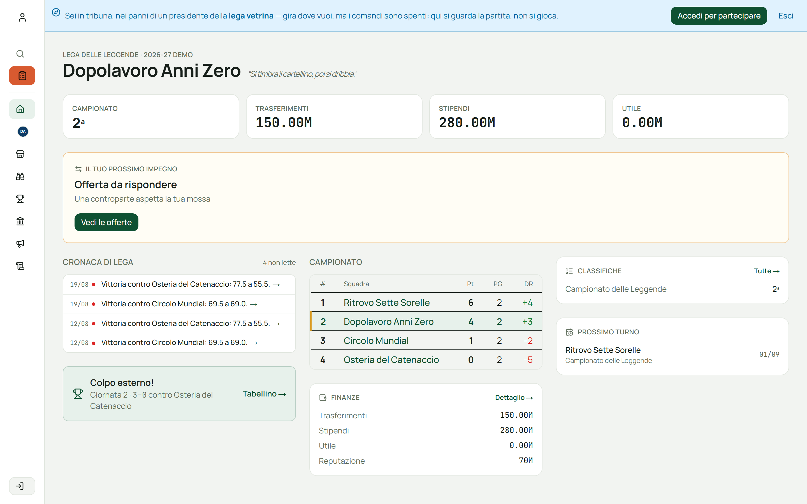
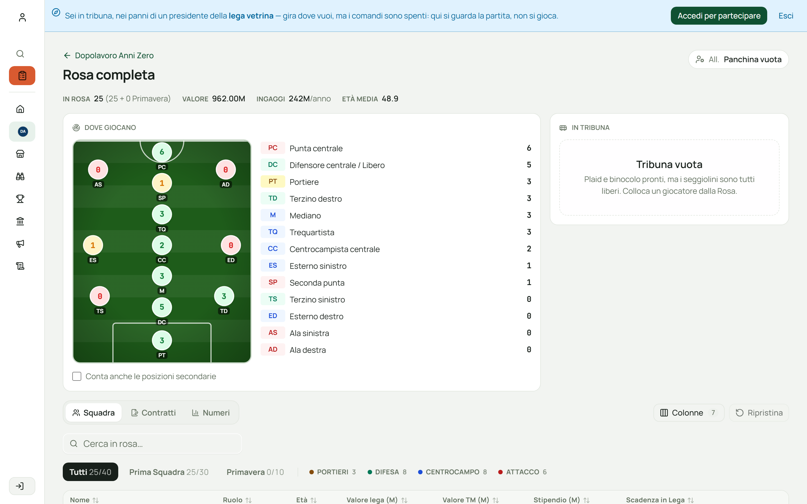
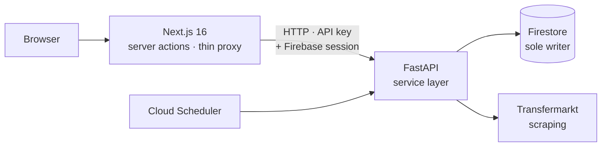
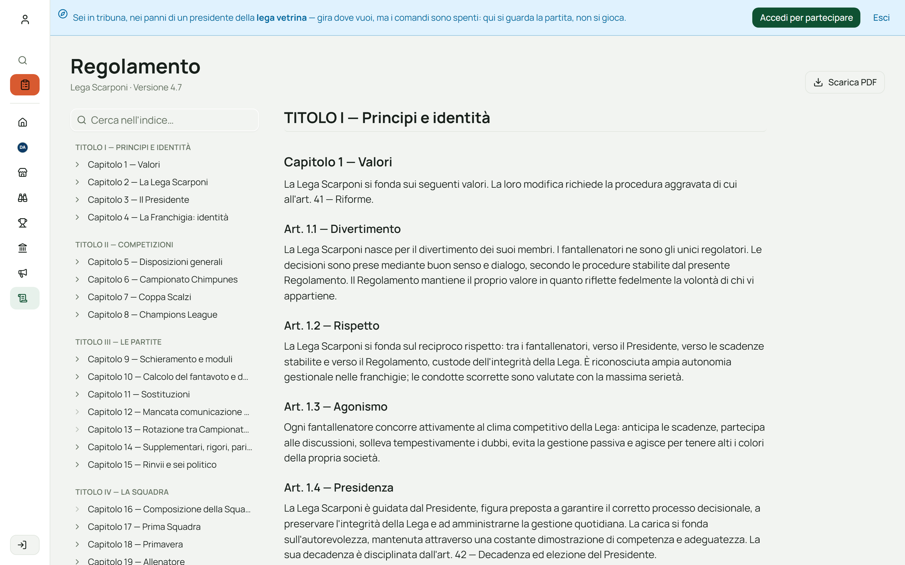

# Fantacarriera

**A career-mode fantasy football manager for Serie A, in production, with real users.**

### → **[Walk through the live app](https://fantacarriera.app)**, clicking *Esplora la Lega*. No signup, no email, nothing to install.

You land as the president of a showcase club. Every page is real and every number is
computed by the live engine; the controls are switched off, so you can look at anything
without changing anyone's season.

> This repository is a **showcase**, with no source code in it. The two repos behind the
> product are private, because a real league plays in there. What follows is what the
> thing is, how it's built, and what it took.

---

## What it is

Classic fantasy football resets every August: you re-draft, and last year never happened.
Fantacarriera doesn't reset. A club is a going concern. It carries a squad under
multi-year contracts, a wage bill, three separate budgets, a reputation, a stadium with a
capacity that grows or shrinks, a youth team, and a trophy cabinet that remembers.

That turns a game of picking players into a game of **running a club**: you sell a striker
you can no longer pay, you promote a 19-year-old before he ages out of the youth squad, you
weigh a fourth-place finish against a wage bill you'll still be paying in two seasons.

Ten people run eight clubs in it, every week. The rules are a written constitution of 41
chapters, amendable by vote, and the software is its enforcement.

  

---

## What's actually hard about it

**A rulebook is not a spec.** 41 chapters of natural language, written by and for humans,
that have to become deterministic code, and stay in sync when the league amends them. The
rulebook ships inside the app (below), so the text people vote on and the text the engine
obeys cannot drift apart.

**Money has to be conserved.** Three separate ledgers (transfers, wages, reputation) that
must balance to the cent across auctions, swaps, releases, penalties and season rollover. A
transfer isn't zero-sum: the league takes a cut. Every gesture that moves money is one
atomic batch, because a half-completed signing is a corrupted season.

**Time moves on its own.** Contracts expire, players age out of the youth squad, morale
drifts, market windows open and close, matchdays get scored. The season advances whether or
not anyone opens the app, so most of the machinery is scheduled work that has to be
idempotent. The same day must never be paid twice.

**The reads have to be cheap.** Firestore bills per document read. A dashboard that
casually fans out over a league's worth of documents is a dashboard that costs real money
every time someone refreshes it.

  

---

## How it's built

| | |
|---|---|
| **Frontend** | Next.js 16 (App Router, server actions), TypeScript, Tailwind, shadcn/ui |
| **Backend** | Python, FastAPI. Scraping, scoring engine, scheduled jobs, all persistence |
| **Data** | Firestore, written only by the backend through the Admin SDK; rules deny-all to everyone else |
| **Auth** | Firebase Auth; a static key between the services, plus a session token on every write |
| **Hosting** | Both services on Cloud Run (`europe-west8`), secrets in Secret Manager, domain via Cloudflare |

The frontend holds no business logic. It is deliberately a thin proxy: one service owns the
data and the rules, so there is exactly one place where a rule can be wrong.

Every non-obvious decision is written down as an **ADR** before the code exists. There are
68 of them so far, covering things like why money is stored in integer cents, why writes
need a second gate, and why the ledger was split into three.

  

---

## Scale

Six months, built solo, from empty repo to production:

| | Frontend | Backend |
|---|---:|---:|
| Commits | 764 | 429 |
| Lines | 114k | 79k |
| Test files | 222 | 125 |

Plus 68 architecture decision records, a 41-chapter rulebook kept in three synchronised
formats, and a season of real play on top of it.

---

## Try it

**<https://fantacarriera.app>** → *Esplora la Lega*.

Start on the dashboard, open **Rosa** to see a squad under contract, then **Finanze** for
the ledger and **Regolamento** for the constitution the whole thing enforces. The app is in
Italian, since an Italian league plays in it, but the shape of it reads without the
language.

---

Built by <a href="https://github.com/teodea">Matteo De Angelis</a>. The source stays private, since a real league plays in there.
